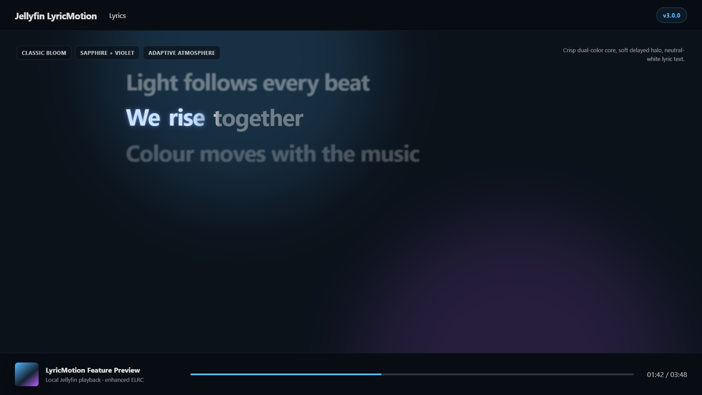
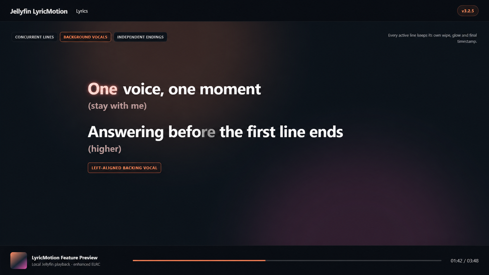

# Jellyfin LyricMotion

[](https://github.com/ThisIsTeddyBear/Jellyfin-LyricMotion/actions/workflows/validate.yml)
[](https://github.com/ThisIsTeddyBear/Jellyfin-LyricMotion/releases)
[](LICENSE)

An unofficial Jellyfin Web enhancement for fluid enhanced lyrics on desktop and mobile: ELRC karaoke motion, overlapping/background vocals, **fully offline on-device Romanization**, per-song lyric timing correction, multilingual Classic Bloom, and adaptive album atmosphere.

> [!IMPORTANT]
> LyricMotion is a community project. It is not affiliated with or endorsed by the Jellyfin Project or Apple Inc. It patches only the Jellyfin Web client installed on your own server.

> [!NOTE]
> **TV policy:** LyricMotion intentionally hard-bypasses TV-class clients. Detected TVs use Jellyfin's stock lyrics experience with no LyricMotion fetch/XHR interception, observers, media hooks, lyric DOM decoration, Romanizer loading, or timing controls. Desktop and mobile remain enhanced. See [TV Stock Bypass](docs/TV-STOCK-BYPASS.md).

## What's new in 3.2.0 / LyricG2P 6.5.1

This repository now tracks the **optimized final LyricG2P 6.5.1 implementation** on the Jellyfin LyricMotion 3.2.0 application baseline.

- **Best-of-both hybrid Romanization**: deterministic lyric-specific phonology, curated lexical knowledge, production morphology, stronger shared-Devanagari phrase context, targeted Hindi/Punjabi learned schwa advice, richer Malayalam phonetic IR, and category-aware candidate selection.
- **Playback fast path**: normal `romanize()` no longer pays for full diagnostic edit-alignment provenance unless guarded morphology actually needs it. In the controlled fresh-process Node benchmark, mixed normal Romanization improved by **74.3%**, Punjabi by **80.1%**, and Devanagari by **85.6%** versus the frozen pre-optimization 6.5.1 implementation.
- **Karaoke mapping hardening**: NFC/NFD coordinate maps, real-script anchor checks, ZWJ/ZWNJ-chain handling, monotonic generic fallbacks, and span-clamped provenance protect source-to-Roman cue mapping even on hostile provider text.
- **Smarter candidate authority**: curated lexicon and protected morphology stay authoritative; strong same-language learned/provider candidates can replace weak or shared-script-ambiguous local outputs without letting raw model confidence override known pronunciations.
- **Malayalam improvements**: correct legacy chillu handling is combined with separate display and phonetic interpretations for contextual realizations.
- **Shared-script language context**: Hindi/Marathi/Bhojpuri/Nepali phrase evidence is stronger while isolated genuinely ambiguous Devanagari tokens can remain unresolved instead of being forced to Hindi.
- **Targeted learned components only**: compact Hindi/Punjabi schwa advisors are fully local and lazy. No full neural native-to-Roman checkpoint is bundled.
- **Whole-project hardening**: strict Romanizer-version compatibility, metadata-aware candidate deduplication, bounded pathological edit-distance work, staged installer assets, invalid nested-TTML timing rejection, dataset-pipeline validation, deterministic packaging, checksums, browser-runtime smoke tests, and expanded CI.
- **UI remains compact**: Romanization and the single lyric-timing chip remain the normal lyric controls; TV-class clients still hard-bypass to stock Jellyfin lyrics.

### Validation snapshot

The final optimized tree passed **32 reviewed Romanization regressions**, **500 base Unicode fuzz cases**, **3,000 focused hybrid/model/provenance fuzz cases**, a separate **10,000-case adversarial Unicode/provenance run**, and a **5,000-string frozen-vs-optimized differential** with identical normal output, detailed text, and tested source boundaries. The held-out 2,500-word Dakshina Tamil benchmark produced **zero output differences** from frozen 6.5.1.

The benchmark numbers are development-machine measurements, not browser/TV latency guarantees. See the detailed reports rather than treating a single throughput number as a language-quality score.

Read: [LyricG2P 6.5.1](docs/LYRICG2P-6.5.1.md), [Song Style](docs/LYRICG2P-6.5.1-STYLE.md), [Three-Way Benchmark](docs/LYRICG2P-6.5.1-THREE-WAY-BENCHMARK.md), [Optimization & Hardening](docs/OPTIMIZATION-HARDENING-3.2.0-LYRICG2P-6.5.1.md), and [Release Notes](docs/RELEASE-NOTES-3.2.0-LYRICG2P-6.5.1.md).

## Feature gallery

### Classic Bloom and adaptive atmosphere



Classic Bloom uses a crisp letter-bound core followed by a softer dual-color halo and afterglow. Album artwork is sampled once per track into a small prebaked atmosphere bitmap; playback does not run a live full-screen blur.

### Concurrent lines and background vocals



LyricMotion tracks an active set instead of a single current line. Overlapping lead/response lines keep independent timing, wipe, glow, and completion. TTML `ttm:role="x-bg"` content can be converted into separately timed ELRC background lanes.

## Supported lyric inputs

| Input | Support | Result |
|---|---|---|
| Enhanced LRC / ELRC | Native | Word/syllable-aware wipe, motion, glow, overlaps, background lanes and exact line endings |
| Standard LRC | Native | Polished line-synced presentation |
| Timed TTML | Converter | Recursive main + `x-bg` extraction into Jellyfin-compatible ELRC |
| Plain unsynced lyrics | Jellyfin fallback | Displayed by Jellyfin without LyricMotion timing effects |

LyricMotion does not download lyrics. It enhances lyric data already available to Jellyfin.

## Install

Download `jellyfin-lyric-motion-v3.2.0.zip` from GitHub Releases, extract it, then run the installer from the extracted folder.

### Windows

Double-click:

```text
INSTALL-WINDOWS.cmd
```

or run PowerShell directly:

```powershell
.\scripts\install.ps1
```

For a custom or portable Jellyfin Web directory:

```powershell
.\scripts\install.ps1 -WebDir "D:\Apps\Jellyfin\Server\jellyfin-web"
```

The Windows launcher requests Administrator access through UAC when needed for a standard `Program Files` Jellyfin installation.

### Linux / macOS

```bash
chmod +x scripts/install.sh scripts/uninstall.sh
sudo ./scripts/install.sh
```

Custom location:

```bash
sudo ./scripts/install.sh --webdir /path/to/jellyfin-web
```

The installers also respect `JELLYFIN_WEB_DIR`. `python3` is required by the POSIX installer for safe HTML patching.

### Docker

Build a derived image rather than editing a running container:

```bash
docker build \
  --build-arg JELLYFIN_TAG=10.11.11 \
  -f docker/Dockerfile \
  -t jellyfin-lyric-motion:10.11.11 \
  .
```

Use the derived image with your existing `/config`, media, cache, networking, and hardware-acceleration configuration.

### After installation

Hard-refresh Jellyfin Web, clear site data, or use a private window. Fully close/reopen mobile clients. Jellyfin upgrades may replace the webroot, so rerun LyricMotion after an upgrade if its injected assets disappear.

## Romanization

For native-script lyrics on desktop/mobile, **Romanize** switches the primary lyric text to local Romanization. The engine is lazy-loaded only when needed.

The Romanizer converts the **complete lyric line first**, then remaps Jellyfin's existing ELRC source-character cue boundaries into the Romanized text. Cue timestamps are not modified.

First-class lyric-aware paths cover:

- Malayalam
- Tamil
- Telugu
- Kannada
- Punjabi / Gurmukhi
- Hindi and other Devanagari-family lyric cases
- Bengali / Assamese
- Gujarati
- Odia
- lexicon-assisted Urdu / Shahmukhi

The broad ICU-derived fallback remains coverage for unsupported scripts; it is not used as the primary Indian-language pronunciation engine. See [Romanization architecture](docs/ROMANIZATION.md).

## Smart lyric timing assistant

The normal toolbar contains just the two compact controls: `A Romanize` and `⏱ +0.0s`. The timing chip opens a small popover only when needed.

- **Fine correction**: `-0.1` / `+0.1`
- **Coarse correction**: `-0.5` / `+0.5`
- **Sync lyric to now**: tap a word/line exactly when it begins and LyricMotion calculates the constant offset automatically
- **Undo / Reset**: immediately revert the previous timing edit or return to source timing
- **Timeline fingerprinting**: stored correction only restores when the exact lyric timeline matches, including cue boundaries and timing

Positive offset delays the lyrics; negative offset makes them appear earlier. Playback itself is never changed. Three-point calibration and drift correction were intentionally removed from the final 3.1.1 design to keep the timing system simple and predictable. See [Smart Timing Assistant](docs/TIMING-ASSISTANT.md).

## Multilingual rendering

LyricMotion no longer treats non-Latin text as a second-class visual path. Malayalam, Tamil, Telugu, Kannada, Gurmukhi, Devanagari and other shaping-safe Indic scripts can use the detailed grapheme/akshara Classic Bloom path when segmentation is safe. Viramas, combining marks and join controls are protected.

Arabic-family joining and unknown complex runs use a whole-shaped-run bloom so contextual glyph connections remain correct. RTL direction and original ELRC timing are preserved. See [Multilingual Rendering](docs/MULTILINGUAL-RENDERING.md).

## Convert TTML to ELRC

```bash
python scripts/ttml_to_elrc.py "/music/Artist/Album/01 - Song.ttml"
```

It writes `01 - Song.elrc` beside the TTML. Keep TTML as the lossless master and make the ELRC basename match the audio basename.

Options:

```text
--no-background     omit background-vocal content
--plain-background  keep background lines without LyricMotion's role token
-o PATH             choose the output path
```

The converter has finite/non-negative timing checks, DTD/entity rejection, a 64 MiB input limit, inherited-end clamping, and atomic output replacement. See [TTML Conversion](docs/TTML-CONVERSION.md).

## Runtime controls

Open the Jellyfin Web developer console:

```javascript
JellyfinLyricMotion.version
JellyfinLyricMotion.diagnostics()
JellyfinLyricMotion.performance()
JellyfinLyricMotion.atmosphere()
JellyfinLyricMotion.romanization()
JellyfinLyricMotion.timing()
JellyfinLyricMotion.explainRomanization('ഇടി')
```

Glow themes:

```javascript
JellyfinLyricMotion.accents()
JellyfinLyricMotion.setAccent('shuffle')
JellyfinLyricMotion.nextAccent()
JellyfinLyricMotion.setAccent('sapphire')
JellyfinLyricMotion.setAccent('off')
```

Performance:

```javascript
JellyfinLyricMotion.setPerformance('auto')
JellyfinLyricMotion.setPerformance('desktop')
JellyfinLyricMotion.setPerformance('mobile')
JellyfinLyricMotion.setPerformance('eco')
```

Atmosphere:

```javascript
JellyfinLyricMotion.setAtmosphere('subtle')
JellyfinLyricMotion.setAtmosphere('balanced')
JellyfinLyricMotion.setAtmosphere('cinematic')
JellyfinLyricMotion.setAtmosphere('off')
JellyfinLyricMotion.refreshAtmosphere()
```

`AppleKaraoke` remains as a compatibility alias for older local-test users.

## Performance model

| Profile | Target | Motion path | Glow path |
|---|---:|---|---|
| Desktop | 60 fps | Multiscript grapheme/whole-shaped eligibility | Prepainted core + halo, 64 opacity buckets |
| Android/mobile | 60 fps | Multiscript grapheme/whole-shaped eligibility | Prepainted core + halo, 64 opacity buckets |
| TV-class client | Stock Jellyfin | Stock Jellyfin | Stock Jellyfin |
| Eco | 20 fps | Whole-word minimal motion | Prepainted layers, 32 buckets |
| Normal LRC | 20 fps | Line-synced | No ELRC per-word work |

Only currently active overlapping lines receive per-frame word updates. Static line classes change at boundaries instead of walking the entire lyric document each frame.

## What installation changes

The installer:

1. locates the installed Jellyfin Web directory;
2. validates the package version and required overlay assets;
3. creates a unique backup of the current `index.html`;
4. removes older LyricMotion/AppleKaraoke loader tags from the working HTML copy;
5. updates `jellyfin-lyric-motion.js`, `jellyfin-lyric-motion.css`, and `jellyfin-lyric-romanizer.js`;
6. commits the edited `index.html` last;
7. leaves Jellyfin's generated JavaScript bundles untouched.

It does **not** modify Jellyfin's database, media, metadata, users, FFmpeg, playback engine, or generated application bundles.

## Uninstall

Windows:

```powershell
.\scripts\uninstall.ps1
```

Linux/macOS:

```bash
sudo ./scripts/uninstall.sh
```

The uninstaller surgically removes LyricMotion loader tags/assets and normally deletes LyricMotion-owned timestamped `index.html` safety backups. Use `-KeepBackups` on PowerShell or `--keep-backups` on POSIX if you intentionally want to retain them.

## Compatibility and validation

The 3.2.0 release targets Jellyfin Web 10.11.x and modern desktop/mobile browsers. TV-class clients are validated as a hard stock-Jellyfin bypass.

The bundled regression suite covers Romanization, Indic language quality, source-to-Roman cue mapping, timing controls, request races/interception, overlapping/background vocals, script safety, multilingual glow, TTML parsing, and installer/uninstaller behavior.

Real behavior can still vary by Jellyfin build, browser/WebView, available fonts and source lyric quality.

## Repository layout

```text
src/                 browser runtime, offline Romanizer, CSS
scripts/             installers, converter, dataset/evaluation tools, release packager
tests/               G2P, runtime, TTML, research-pipeline and static safety gates
research/            regression seeds, benchmark outputs and model experiments
docs/                architecture, benchmarks, release notes, audits and feature docs
examples/            ELRC examples
docker/              derived Jellyfin image
.github/workflows/   validation and tag-driven release automation
```

## Development

Run the complete local suite:

```bash
sh scripts/test-all.sh
```

Or run individual contracts; see [Contributing](CONTRIBUTING.md).

Build the deterministic release package:

```bash
mkdir -p dist
python3 scripts/package_release.py \
  --version "$(cat VERSION)" \
  --output "dist/jellyfin-lyric-motion-v$(cat VERSION).zip"
```

For the complete tagging and GitHub Release procedure, see [Releasing](docs/RELEASING.md).

## Privacy

Romanization is fully local/on-device. LyricMotion has no Romanization cloud service and does not intentionally transmit native lyric text to third-party Romanization providers.

## Credits and license

The duration-aware motion approach was inspired by and adapted after reviewing [`binimum/am-lyrics`](https://github.com/binimum/am-lyrics). The bundled broad transliteration fallback is generated from Unicode ICU transliteration data; see [Third-Party Notices](THIRD_PARTY_NOTICES.md).

Jellyfin LyricMotion is distributed under the [Mozilla Public License 2.0](LICENSE).

Jellyfin and Jellyfin Web are separate projects. This repository deliberately does not redistribute a patched Jellyfin Web build or generated `index.html`.
