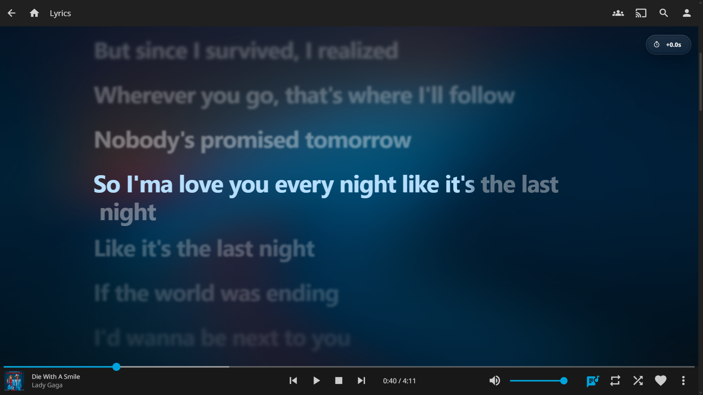
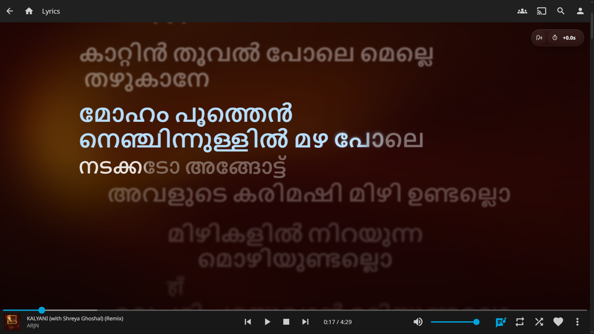
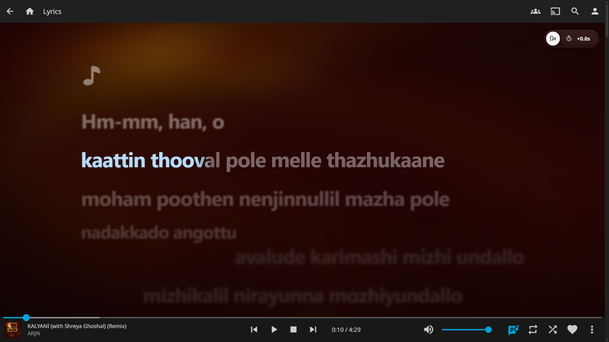
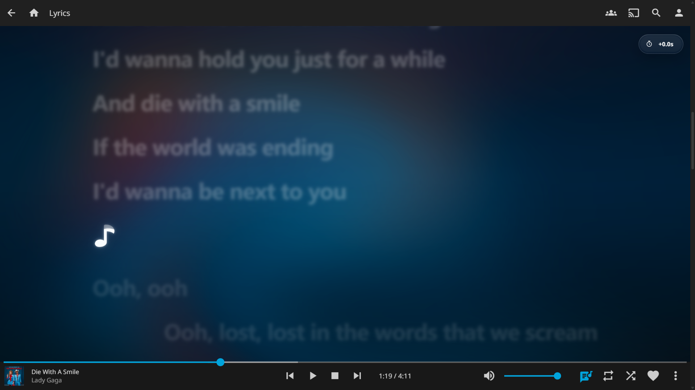

# Jellyfin LyricMotion

[](https://github.com/ThisIsTeddyBear/Jellyfin-LyricMotion/releases)
[](LICENSE)

An unofficial Jellyfin Web overlay for expressive, timing-accurate lyrics on desktop and mobile.



## Highlights

- Word and syllable-synced ELRC karaoke motion, glow, and overlapping vocals.
- Background-vocal placement, instrumental-break progress, multilingual rendering, and per-song timing correction.
- Artwork-driven Dynamic Background and optional Google Romanization.
- Standard LRC and plain lyrics remain supported; TV clients intentionally keep Jellyfin's stock lyric view.

LyricMotion enhances lyric files already available to Jellyfin; it does not download lyrics.

## In action

### Multilingual lyrics and background vocals



LyricMotion preserves complex-script shaping while keeping separately timed TTML/QRC background vocals attached to the active lead.

### Romanization



Romanized view is optional and retains the source ELRC timing.

### Instrumental-break progress



The progress note is shown only where the lyric source provides a trustworthy vocal end.

## Install

Download the archive for your platform from [Releases](https://github.com/ThisIsTeddyBear/Jellyfin-LyricMotion/releases), extract it, then run the installer.

**Windows**

```powershell
.\INSTALL-WINDOWS.cmd
# or: .\scripts\install.ps1
```

For a custom Jellyfin Web folder:

```powershell
.\scripts\install.ps1 -WebDir "D:\Apps\Jellyfin\Server\jellyfin-web"
```

**Linux / macOS**

```bash
chmod +x scripts/install.sh scripts/uninstall.sh
sudo ./scripts/install.sh
```

Use `--webdir /path/to/jellyfin-web` for a custom location. The POSIX installer needs `python3`.

**Docker**

```bash
docker build --build-arg JELLYFIN_TAG=10.11.11 -f docker/Dockerfile -t jellyfin-lyric-motion:latest .
```

Use the resulting image in place of your normal Jellyfin image. After any installation, hard-refresh Jellyfin Web (or clear site data); rerun the installer after Jellyfin upgrades if its web assets are replaced.

## Why use `ttml_qrc_to_elrc`?

ELRC carries word/syllable timestamps, which unlock LyricMotion's karaoke sweep, precise glow, concurrent vocals, and reliable instrumental-break timing. Standard LRC only has line timing, so it receives the lighter line-synced presentation.

Our converter preserves LyricMotion-specific vocal information when present, including TTML `x-bg` background vocals. It deliberately writes `.lrc` for line-timed sources and `.elrc` only when real word/syllable timing exists, including an explicitly timed single word. Renaming an LRC file to ELRC cannot create karaoke timing.

From a source checkout (the converter is not included in release archives):

```bash
python scripts/ttml_qrc_to_elrc.py "/music/Artist/Album/01 - Song.ttml"
```

It accepts `.ttml`, `.dfxp`, and `.qrc`, and writes beside the source. Keep the original as the master and ensure the output basename matches the audio file. Run without an input to convert the current folder; add `--recursive` for subfolders.

Useful options: `--skip-existing`, `--no-background`, `--plain-background`, `--replace-alternate`, and `-o OUTPUT`. See [conversion details](docs/TTML-CONVERSION.md).

## Usage notes

- Turn on **Romanized** view only if you are comfortable sending native-script lyric text to Google Translate. Failed requests leave the original text unchanged.
- Use the timing chip to adjust a consistently early/late lyric file or select **Sync lyric to now** and tap the lyric at its start.
- Jellyfin Web `10.11.x` and modern desktop/mobile browsers are the target. TV-class clients are intentionally untouched.

## Uninstall

```powershell
.\scripts\uninstall.ps1
```

```bash
sudo ./scripts/uninstall.sh
```

The uninstaller removes LyricMotion assets and loader tags without replacing unrelated `index.html` changes.

## Docs

- [TTML/QRC conversion](docs/TTML-CONVERSION.md)
- [Features and platform support](docs/PLATFORM-ARCHITECTURE.md)
- [Google Romanization privacy](docs/GOOGLE-ROMANIZATION.md)
- [Installation details](docs/INSTALLATION-ARCHITECTURE.md)
- [Release process](docs/RELEASING.md)

## License

Jellyfin LyricMotion is licensed under the [Mozilla Public License 2.0](LICENSE). It is a community project, unaffiliated with Jellyfin or Apple.
