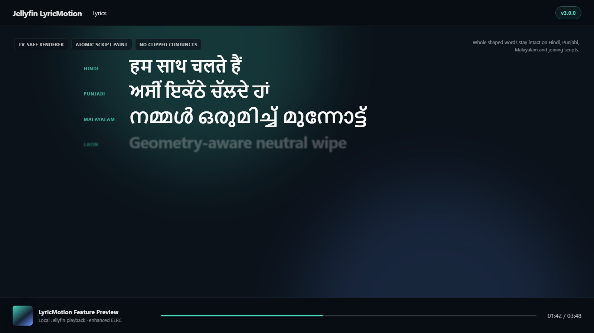

# Jellyfin LyricMotion

[](https://github.com/ThisIsTeddyBear/Jellyfin-LyricMotion/actions/workflows/validate.yml)
[](https://github.com/ThisIsTeddyBear/Jellyfin-LyricMotion/releases)
[](LICENSE)

An unofficial Jellyfin Web enhancement for fluid enhanced lyrics, concurrent vocal lines, background vocals, script-safe rendering, adaptive atmosphere, and a performance-aware Classic Bloom glow.

> [!IMPORTANT]
> LyricMotion is a community project. It is not affiliated with or endorsed by the Jellyfin Project or Apple Inc. It patches only the web client installed on your own Jellyfin server.

## Feature gallery

### Classic Bloom and adaptive atmosphere


Classic Bloom uses a crisp letter-bound core followed by a softer dual-color halo and afterglow. The lyric fill remains neutral white. A shuffled bag chooses one of 24 curated themes for each new playback without permanently binding a color to a song. Album artwork is sampled and blurred once per track into a small prebaked atmosphere bitmap; playback does not run a live full-screen blur.

### Concurrent lines and background vocals


LyricMotion tracks an active set instead of a single current line. If a response begins before the earlier line finishes, both keep their own wipe, glow, and end timestamp. TTML `ttm:role="x-bg"` text can be converted into a separately timed ELRC background lane, so ad-libs and backing vocals no longer disappear or get appended to the lead lyric.

### Script-safe TV rendering



Hindi, Punjabi, Malayalam, Arabic, and other joining scripts use an atomic luminance reveal. Complete browser-shaped words remain intact; moving clip edges and per-glyph transforms cannot cut through conjuncts, matras, or joined letters. Latin text keeps its geometry-aware spatial wipe.

_The gallery uses purpose-built, non-song feature fixtures rendered with the release CSS._

## What v3.0 adds

- **Independent overlapping lines** - every line remains active until its own final cue, even after a newer line starts.
- **Background-vocal lanes** - converted `x-bg` vocals receive compact hierarchy, exact syllable timing, independent completion, and restrained glow.
- **Classic Bloom v3.1** - two prepainted glow layers with a fast core, delayed halo, soft-knee energy curve, luminance limiting, and no per-frame shadow-string construction.
- **24 shuffled color themes** - dual-color palettes vary between playbacks, avoid recent repeats, and remain stable for the current play.
- **TV focus synchronization** - on Jellyfin TV layouts, line presentation waits for the host focus/current-line signal, arms for 90 ms, and repays timing debt with bounded catch-up instead of jumping.
- **TV compositor discipline** - real frame-rate gating, monotonic projected time, opacity-only line changes, prepainted whole-word glow, and no native button casing.
- **Connected-script safety** - post-coalesced grapheme boundaries, atomic paint, normal tracking, targeted font stacks, and expanded ink gutters for Devanagari, Gurmukhi, Malayalam, and joining scripts.
- **End-glyph overscan** - symmetric paint gutters prevent final characters such as `W`, italic overhangs, and antialiasing from being trimmed.
- **Adaptive Album Atmosphere** - artwork colors with accent fallback, crossfaded once per song and scaled down for mobile, TV, and eco profiles.
- **Normal LRC fallback** - line-synced lyrics remain supported at a low-cost cadence.
- **Diagnostics** - current active set, overlap peaks, TV activation debt, background-vocal count, performance profile, glow theme, atmosphere state, and script profiles are inspectable from the console.

## Supported lyric inputs

| Input | Support | Result |
|---|---:|---|
| Enhanced LRC / ELRC | Native | Word- or syllable-aware wipe, motion, glow, overlaps, and explicit line endings |
| Standard LRC | Native | Polished line-synced presentation |
| Timed TTML | Converter | Recursive main and `x-bg` extraction into Jellyfin-compatible ELRC |
| Plain unsynced lyrics | Jellyfin fallback | Displayed by Jellyfin without LyricMotion timing effects |

LyricMotion does not download lyrics. It enhances sidecars and lyric data already available to Jellyfin.

## Install

Download `jellyfin-lyric-motion-v3.0.1.zip` from [GitHub Releases](https://github.com/ThisIsTeddyBear/Jellyfin-LyricMotion/releases), extract it, and run the installer from the extracted directory.

### Windows

Double-click `INSTALL-WINDOWS.cmd`, or run:

```powershell
.\scripts\install.ps1
```

For a custom or portable Jellyfin Web directory:

```powershell
.\scripts\install.ps1 -WebDir "D:\Apps\Jellyfin\Server\jellyfin-web"
```

The Windows launchers request Administrator access through UAC when Jellyfin is installed under `Program Files`.

### Linux and macOS

```bash
chmod +x scripts/install.sh scripts/uninstall.sh
sudo ./scripts/install.sh
```

Custom location:

```bash
sudo ./scripts/install.sh --webdir /path/to/jellyfin-web
```

The installers also respect `JELLYFIN_WEB_DIR`. `python3` is required by the POSIX installer for safe HTML patching.

### Docker

Build a derived image instead of editing a running container:

```bash
docker build \
  --build-arg JELLYFIN_TAG=10.11.11 \
  -f docker/Dockerfile \
  -t jellyfin-lyric-motion:10.11.11 \
  .
```

Use the derived image with your existing `/config`, media, cache, networking, and hardware-acceleration configuration.

### After installation

Fully close and reopen TV/mobile clients. In a browser, hard-refresh, clear site data, or use a private window. Jellyfin upgrades may replace its webroot; rerun LyricMotion after an upgrade if the injected assets disappear.

## Convert TTML to ELRC

The included converter recursively preserves nested main text, syllable timing, paragraph timing, and `ttm:role="x-bg"` vocals:

```bash
python scripts/ttml_to_elrc.py "/music/Artist/Album/01 - Song.ttml"
```

It writes `01 - Song.elrc` beside the TTML. Keep the TTML as the lossless master and make the ELRC basename exactly match the audio basename.

Options:

```text
--no-background     omit background-vocal content
--plain-background  keep background lines without LyricMotion's invisible role marker
-o PATH             choose the output file
```

See [TTML conversion](docs/TTML-CONVERSION.md) for timing behavior, role transport, and library-refresh instructions.

## Runtime controls

Open the Jellyfin Web developer console.

```javascript
JellyfinLyricMotion.version
JellyfinLyricMotion.diagnostics()
JellyfinLyricMotion.performance()
JellyfinLyricMotion.atmosphere()
```

Glow themes:

```javascript
JellyfinLyricMotion.accents()
JellyfinLyricMotion.setAccent('shuffle')
JellyfinLyricMotion.nextAccent()
JellyfinLyricMotion.setAccent('sapphire')
JellyfinLyricMotion.setAccent('off')
```

Performance profiles:

```javascript
JellyfinLyricMotion.setPerformance('auto')
JellyfinLyricMotion.setPerformance('desktop')
JellyfinLyricMotion.setPerformance('mobile')
JellyfinLyricMotion.setPerformance('tv')
JellyfinLyricMotion.setPerformance('eco')
```

Atmosphere:

```javascript
JellyfinLyricMotion.setAtmosphere('subtle')
JellyfinLyricMotion.setAtmosphere('balanced')
JellyfinLyricMotion.setAtmosphere('cinematic')
JellyfinLyricMotion.setAtmosphere('off')
JellyfinLyricMotion.refreshAtmosphere()
```

The legacy `AppleKaraoke` console name remains as a compatibility alias for v2.x local-test users.

## Performance model

| Profile | Target | Motion path | Glow path |
|---|---:|---|---|
| Desktop | 60 fps | Full geometry/per-glyph eligibility | Prepainted core + halo, 64 opacity buckets |
| Android/mobile | 30 fps | Short-word detail, whole-word fallback | Prepainted layers, 48 buckets |
| TV/webOS | 60 fps gated | Whole-word, focus-synchronized | Prepainted layers, 32 buckets |
| Eco | 20 fps | Whole-word minimal motion | Prepainted layers, 32 buckets |
| Normal LRC | 20 fps | Line-synced | No ELRC per-word work |

Only currently active overlapping lines receive per-frame word updates. Static line classes change at boundaries instead of walking the whole lyric document on every frame.

### Why motion is not identical on every device

The profiles deliberately share timing and design rather than identical GPU work. Desktop has enough compositor headroom for the full geometry/per-glyph path. Android uses fewer detailed layers and a 30 fps target to reduce sustained heat. LG/webOS uses whole shaped words, an actual 60 fps gate, opacity-only line changes, and host-focus synchronization because desktop-style glyph layers and simultaneous scale/filter transitions caused boundary stutter on the TV browser.

### Why some writing systems use different motion

This is script-based, not English-only. Latin-script languages can use the spatial wipe and eligible per-glyph motion. Devanagari, Gurmukhi, Malayalam, Arabic, and other joining scripts use atomic whole-word luminance and a restrained colored glow. Their conjuncts and vowel marks are shaped across multiple Unicode characters; slicing or moving those characters independently causes the clipping and white seams that the atomic renderer was created to prevent.

## What installation changes

The installer:

1. locates the installed Jellyfin Web directory;
2. creates a unique backup of `index.html`;
3. removes older LyricMotion/AppleKaraoke loader tags;
4. injects `jellyfin-lyric-motion.css` and `jellyfin-lyric-motion.js` before Jellyfin's `runtime.bundle.js`;
5. copies only those two assets.

It does not modify Jellyfin's database, media, metadata, users, FFmpeg, playback engine, or generated JavaScript bundles.

## Uninstall

Windows:

```powershell
.\scripts\uninstall.ps1
```

Linux/macOS:

```bash
sudo ./scripts/uninstall.sh
```

## Compatibility and validation

The v3.0 release targets Jellyfin Web 10.11.x and modern desktop/mobile browsers, with a dedicated compatibility path for LG webOS. Deterministic tests cover:

- overlapping active sets and independent endings;
- same-start lead/background lines;
- delayed TV host focus, 90 ms arm, bounded catch-up, seek/reset, and fallback;
- TTML timing formats and recursive `x-bg` extraction;
- Indic grapheme coalescing with and without `Intl.Segmenter`;
- installer parsing and release packaging.

Real device behavior can still vary by Jellyfin build, firmware, available fonts, and lyric quality. See [TV validation](docs/TV-VALIDATION.md) when reporting an LG/webOS issue.

## Repository layout

```text
src/                 browser runtime and CSS
scripts/             installers, converter, tests, release packager
docs/                architecture, release notes, validation, screenshots
examples/            ELRC examples
docker/              derived Jellyfin image
.github/workflows/   validation and tagged-release automation
dist/local-testing/  ignored local release builds
```

## Development

```bash
node --check src/jellyfin-lyric-motion.js
node scripts/test_overlap_background.js
node scripts/test_tv_overlap.js
node scripts/test_script_safety.js
node scripts/test_release_contract.js
python -m unittest discover -s scripts -p "test_*.py"
python scripts/package_release.py --version 3.0.1
```

See [Contributing](CONTRIBUTING.md) before submitting a pull request.

## Privacy

LyricMotion has no cloud service and does not intentionally transmit lyric or playback data. It runs locally inside Jellyfin Web and reads information already available to that page.

## Credits and license

The duration-aware motion approach was inspired by and adapted after reviewing [`binimum/am-lyrics`](https://github.com/binimum/am-lyrics). Jellyfin LyricMotion is distributed under the [Mozilla Public License 2.0](LICENSE). See [Third-Party Notices](THIRD_PARTY_NOTICES.md).

Jellyfin and Jellyfin Web are separate projects. This repository deliberately does not redistribute a patched Jellyfin Web build or generated `index.html`.
